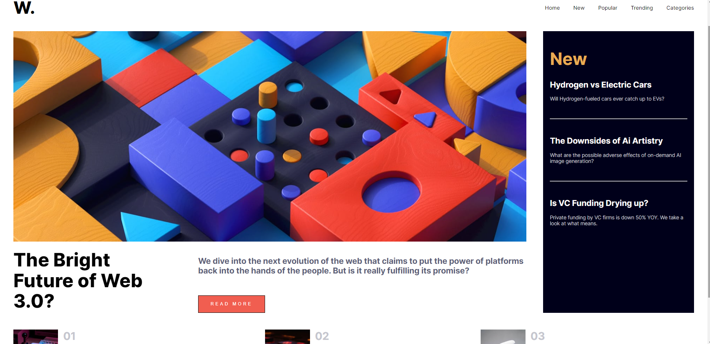
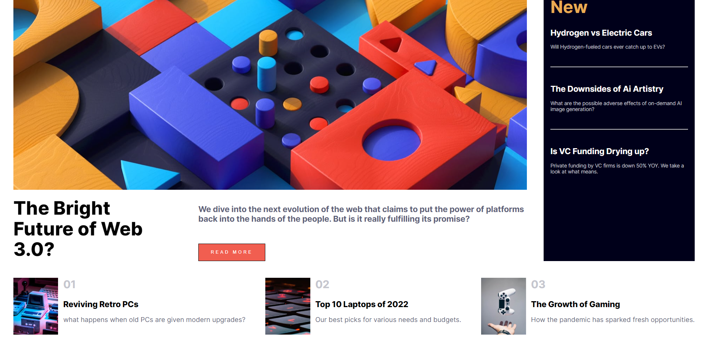

# Frontend Mentor - News homepage solution

This is a solution to the [News homepage challenge on Frontend Mentor](https://www.frontendmentor.io/challenges/news-homepage-H6SWTa1MFl).
## Table of contents

- [Overview](#overview)
  - [The challenge](#the-challenge)
  - [Screenshots](#screenshot)
  - [Links](#links)
- [My process](#my-process)
  - [Built with](#built-with)
  - [What I learned](#what-i-learned)
  - [Continued development](#continued-development)
  - [Useful resources](#useful-resources)
- [Author](#author)

## Overview

### The challenge

Users should be able to:

- View the optimal layout for the interface depending on their device's screen size
- See hover and focus states for all interactive elements on the page

### Screenshot




Add a screenshot of your solution. The easiest way to do this is to use Firefox to view your project, right-click the page and select "Take a Screenshot". You can choose either a full-height screenshot or a cropped one based on how long the page is. If it's very long, it might be best to crop it.

### Links

- Live Site URL: (https://frontend-mentor-news-page.netlify.app/)

## My process

### Built with

- Semantic HTML5 markup
- CSS
- Flexbox
- [React](https://reactjs.org/) - JS library

### What I learned

I learnt to take to time to consider and plan the HTML skeleton before jumping into CSS and styling. The layout of most of the page was done using flexbox and 'nested flexboxes' so it was important to structure the page this way in the html. Even after taking a short time to do this, i noticed when styling that there were some additional flexboxes to add to structure the page correctly.

I was also able to gain more practice creating reusuable UI components with react with the following components:
-Navbar
-main-news
-newarticles
-toposts

```js
    return (
    <>
      <Navbar />
      <div className='news-articles-container'>
        <MainNews />
        <NewArticles />
      </div>
      <div className='all-top-posts-container'>
        <TopPosts number={"01"} title={"Reviving Retro PCs"} paragraph={"what happens when old PCs are given modern upgrades?"} image={"image-retro-pcs"}/>
        <TopPosts number={"02"} title={"Top 10 Laptops of 2022"} paragraph={"Our best picks for various needs and budgets."} image={"image-top-laptops"}/>
        <TopPosts number={"03"} title={"The Growth of Gaming"} paragraph={"How the pandemic has sparked fresh opportunities."} image={"image-gaming-growth"}/>
      </div>
    </>
  )
```

### Continued development

Moving forward

-I would like to begin to integrate more react developer libraries into my app such as the React styled components library.
-I want to learn more about the responsive design workflow and best practices. So far I have mainly been using the 'breakpoints' recommendation I found online and manually dragging the width of the chrome browser until it reaches widths that 'break' the design of the app, and then using media queries to change my design accordingly once it reaches these max widths (going down from large desktop sizing).

## Author

- Website - [Blake McKenzie](troopl.com/blakemckenzie)
- Frontend Mentor - [@yourusername](https://www.frontendmentor.io/profile/BlakeMack)
